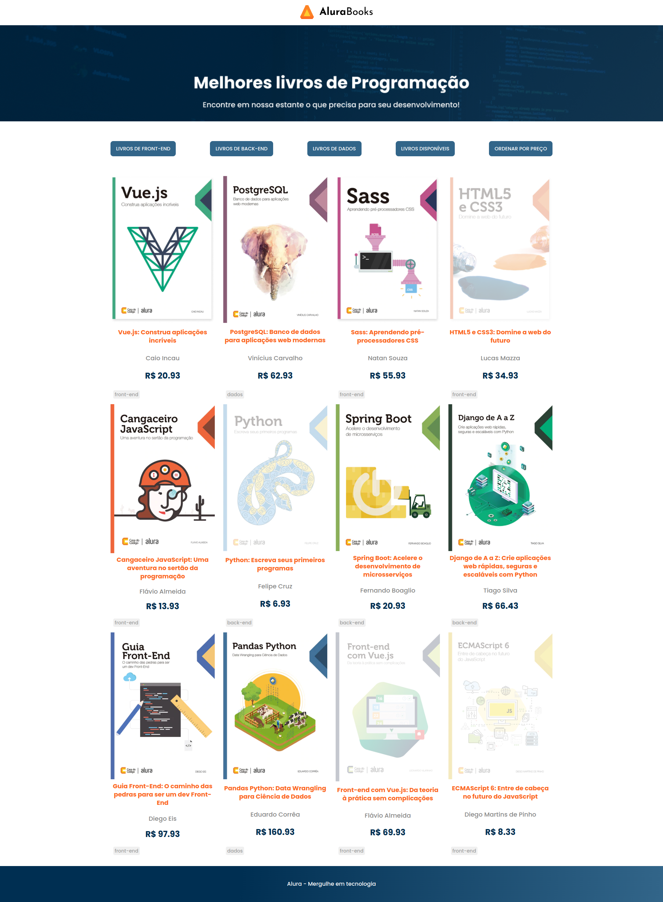

# AluraBooks

Site de uma livraria com livros separados por categorias, livros disponíveis e por ordem de preço.

Para visualizar o projeto e navegar <a href="https://mayaraplaza.github.io/Estudos-FrontEnd-Alura/AluraBooks/"> clique aqui </a>

## Detalhes do projeto

Projeto usando HTML, CSS e JavaScript com foco na prática dos métodos de array. Nesse projeto aprendi:  
• Como a utilizar os principais métodos de array do JavaScript;  
• Manipular o DOM com base nos métodos de array;  
• Como aplicar ordenação e filtros em meus projetos JavaScript;  

## Screenshot

  </img>

